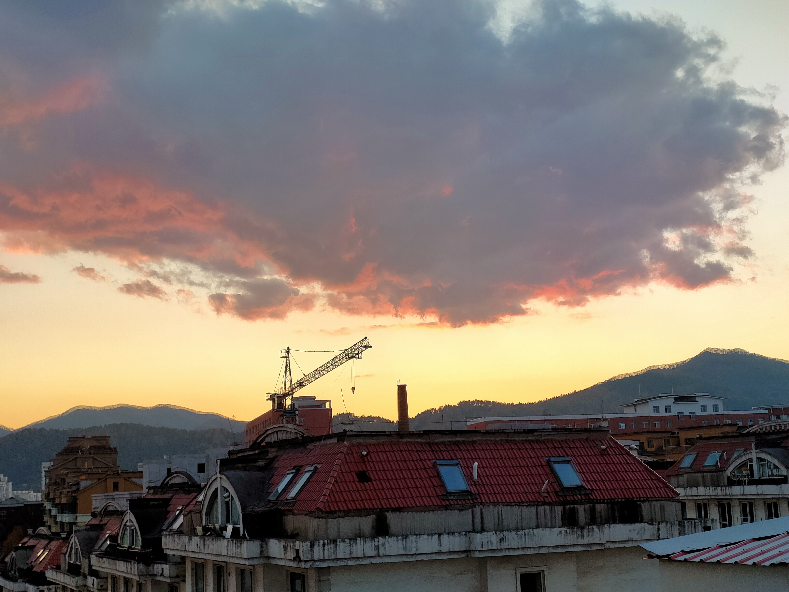

image::images/daming.jpg[image]
= 你好！Hello! Salut! 
image::images/yihe.jpg[align="right", height=440px, width=50%, margin-left=40px]

[source, javascript]
----
const dedicate = (reader) => {
    const theone = "myUniqueRose";
    const myparents = "myParents";

    if (reader === theone) {
        console.log("To my summer...");
    } else if (reader === myparents) {
        console.log("To my parents...");
    } else {
        console.log("To the people who came here...");
    }
}
----

Hello and welcome to my homepage! 

My name is Jianqi Yang,in Chinese, it’s 杨建祺.

What you’re looking for is probably link:Instruction.md[here], and then this is my link:https://thinkswhat.github.io[homepage].

= About me

//--
//

//        <a href="https://github.com/thinkswhat">
//            
//        <a href="">
//            
//        <a href="https://x.com/LuckyYo70152293">
//            
//        <a href="https://www.researchgate.net/profile/Jianqi-Yang-2">
//            
//        <a href="mailto:jianqiy4@gmail.com">
//            
//-->

//--
//

//  <table>
//    <tr>
//      <td align="center"></td>
//      <td align="center"></td>
//    </tr>
//  </table>
//

//--

== Biography
=== Interests
- Statistics, Data Science and Machine Learning, etc
- AI4Science, especially in Atmospheric Sciences

=== Professional Skills
- R: package development (e.g., Atmospheric data analysis toolkits)
- Python: web crawler, database toolkit, data visualization and analysis, etc

=== Hobbies
- Classical guitar: classical, folk, and blues
- Traditional Chinese flute: Nanxiao and Dongxiao

=== Education
- PhD: Atmospheric Sciences, Sun Yat-sen University (expected 2024)
- MSc: Applied Mathematics, Sun Yat-sen University (2019)
- BSc: Applied Physics, South China University of Technology (2016)

== Tools & Technologies

=== Languages
* Python
* R
* JavaScript
* C++

=== Tools
* PyCharm
* VS Code
* Jupyter Notebook

=== Platforms
* GitHub
* GitLab
* Bitbucket

== Publications
- [Paper 1](link to paper 1)
- [Paper 2](link to paper 2)
- [Paper 3](link to paper 3)

== Projects
=== Project 1
Description of project 1

=== Project 2
Description of project 2

== Contact
* Email: jianqiy4@gmail.com

== Acknowledgements
- Thank you to my family, friends, and colleagues.

== Something else about me
我的人生就是在另一个这样的夕阳中确定的。

Since that day, I’ve been looking for an acre of land, between salt water and the sea strands.

//--
//**thinkswhat/thinkswhat** is a ✨ _special_ ✨ repository because its `README.md` (this file) appears on your GitHub profile.
//
//Here are some ideas to get you started:
//
//- 🔭 I’m currently working on ...
//- 🌱 I’m currently learning ...
//- 👯 I’m looking to collaborate on ...
//- 🤔 I’m looking for help with ...
//- 💬 Ask me about ...
//- 📫 How to reach me: ...
//- 😄 Pronouns: ...
//- ⚡ Fun fact: ...
//--
