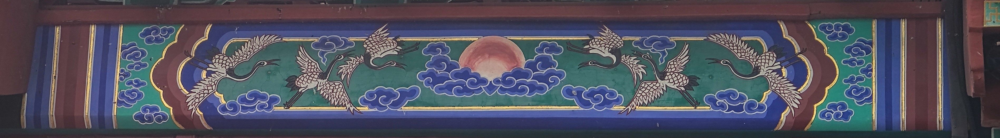

# 你好！Hello! Salut!  
```JavaScript
const dedicate = (reader) => {
    const theone = "myUniqueRose";
    const myparents = "myParents";

    if (reader === theone) {
        console.log("To my summer...");
    } else if (reader === myparents) {
        console.log("To my parents...");
    } else {
        console.log("To the people who came here...");
    }
}
```
Hello and welcome to my homepage! 

My name is Jianqi Yang,in Chinese, it's 杨建祺.

What you're looking for is probably [here](https://github.com/thinkswhat/Publication), and then this is my [homepage](https://thinkswhat.github.io).



# About me
<div align="center">
        <a href="https://github.com/thinkswhat">
            
        <a href="">
            
        <a href="https://x.com/LuckyYo70152293">
            
        <a href="https://www.researchgate.net/profile/Jianqi-Yang-2">
            
        <a href="mailto:jianqiy4@gmail.com">
            
</div>
<!--
<div align="center">
  <table>
    <tr>
      <td align="center"></td>
      <td align="center"></td>
    </tr>
  </table>
</div>
-->

## Biography
### Interests
- Statistics and Machine Learning
- AI4Science
- Atmospheric science
## Tech &amp; Tools Preference
Tools that I use on a daily basis, or that I've used or worked (either much or a bit) with on the past.
<div>
    📕 Language:
    
    
    
    
    
    
    
    
<div>
    🔧 Platform:
    
    
    
    
    
    
<div>
    🤖 ML &amp; DL:
    
    
    
    
</div>	
    🎀 Pub &amp; Pre:
    
    
    
    
    
<div>
    🌟 Interested:
    
    
    
    
    
    
    
<div>

## Something else about me
我的人生就是在另一个这样的夕阳中确定的。

Since that day, I've been looking for an acre of land, between salt water and the sea strands.


<!--
**thinkswhat/thinkswhat** is a ✨ _special_ ✨ repository because its `README.md` (this file) appears on your GitHub profile.

Here are some ideas to get you started:

- 🔭 I’m currently working on ...
- 🌱 I’m currently learning ...
- 👯 I’m looking to collaborate on ...
- 🤔 I’m looking for help with ...
- 💬 Ask me about ...
- 📫 How to reach me: ...
- 😄 Pronouns: ...
- ⚡ Fun fact: ...
-->
